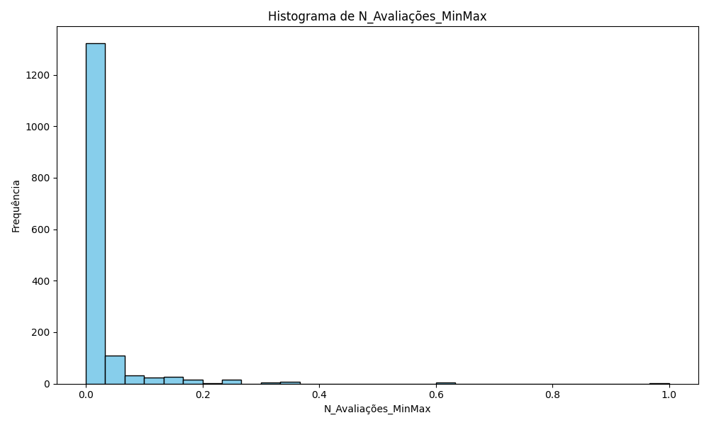
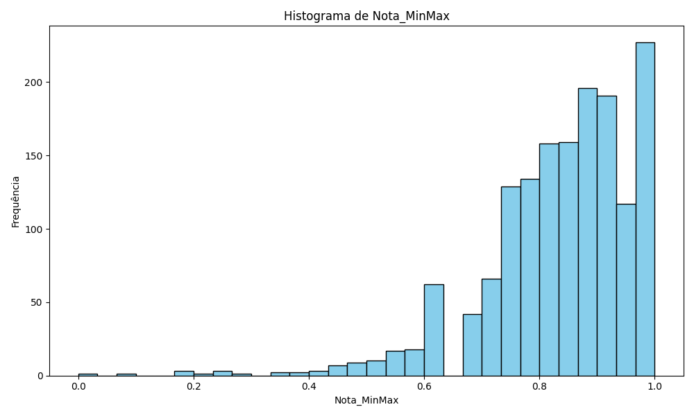
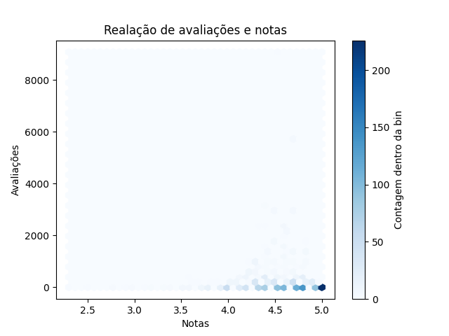
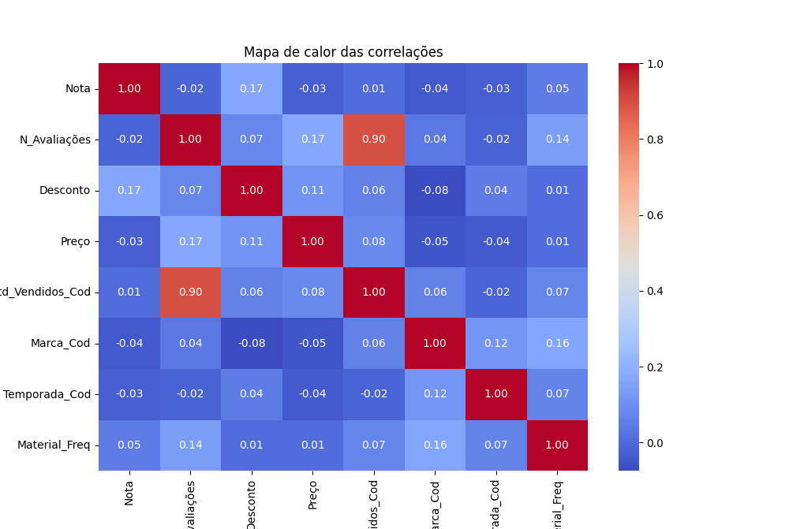
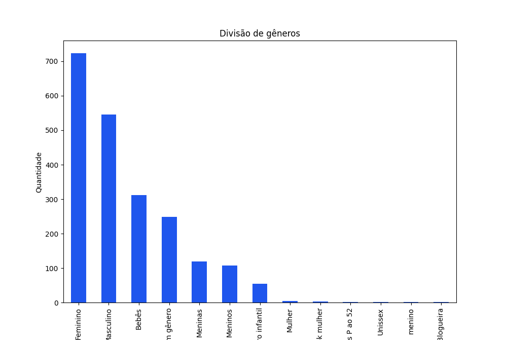
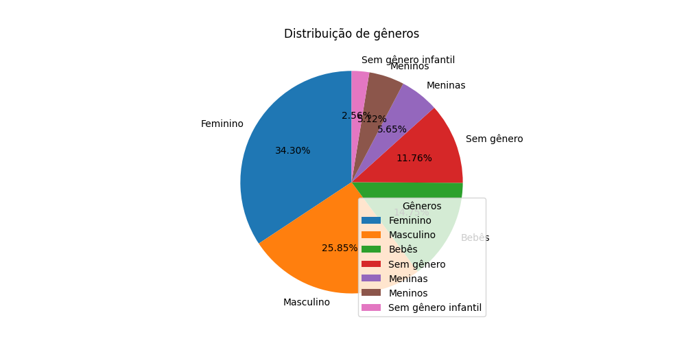
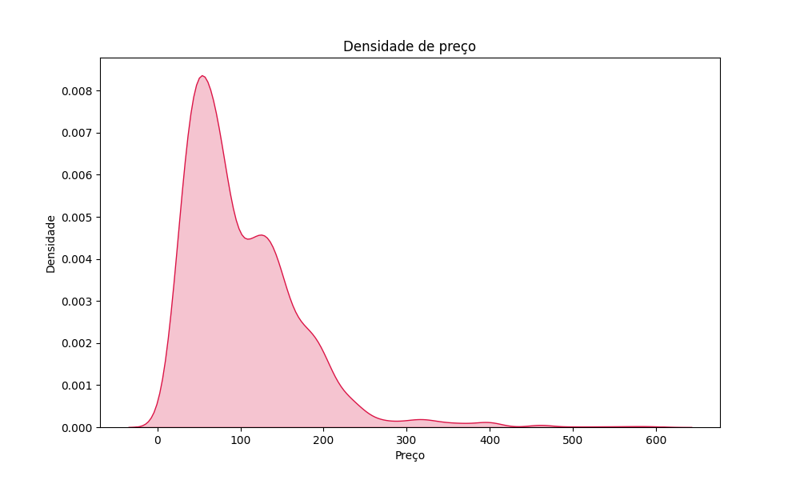
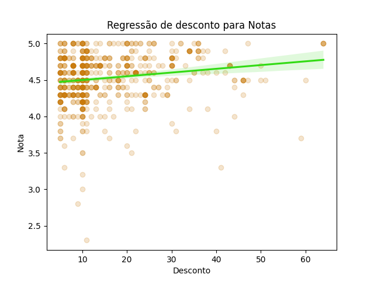

# Análise de Dados de E-commerce

Este projeto utiliza a biblioteca **pandas**, **matplotlib** e **seaborn** para realizar uma análise exploratória dos dados de um e-commerce. Os principais gráficos gerados são listados abaixo, cada um representando aspectos diferentes da distribuição e relação entre variáveis.

## 📊 Gráficos Gerados

### 1️⃣ Histogramas
Os histogramas mostram a distribuição das variáveis **N_Avaliações_MinMax**, **Nota_MinMax** e **Preço_MinMax**. Cada gráfico exibe a frequência de cada valor dentro de um intervalo específico.



### 2️⃣ Gráficos de Dispersão
- **Relação de avaliações e notas**: Exibe a correlação entre o número de avaliações e a nota dos produtos.

- **Relação de preço com notas**: Mostra como o preço dos produtos influencia suas notas.

### 3️⃣ Mapa de Calor das Correlações
Este gráfico permite visualizar a relação entre variáveis como **Nota**, **Número de Avaliações**, **Desconto**, **Preço** e outros atributos. A intensidade das cores indica o grau de correlação.

### 4️⃣ Gráfico de Barras
Representa a **divisão de gêneros** entre os produtos disponíveis no e-commerce.

### 5️⃣ Gráfico de Pizza
Exibe a **distribuição dos gêneros**, indicando a proporção de cada um no conjunto de dados.

### 6️⃣ Gráfico de Densidade
Mostra a distribuição de preços com uma curva de densidade, facilitando a visualização da concentração dos valores.

### 7️⃣ Gráfico de Regressão
Demonstra a relação entre **desconto** e **nota**, mostrando uma tendência de correlação entre essas variáveis.

## 🛠 Tecnologias Utilizadas
- **Python 3.x**
- **pandas**
- **matplotlib**
- **seaborn**

## 🚀 Como Executar o Código
1. Instale as dependências necessárias:
   ```bash
   pip install pandas matplotlib seaborn